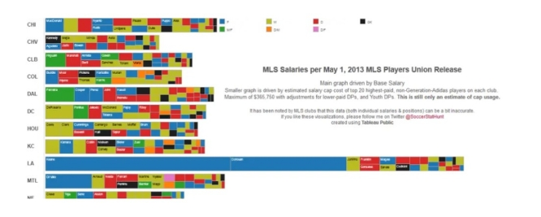
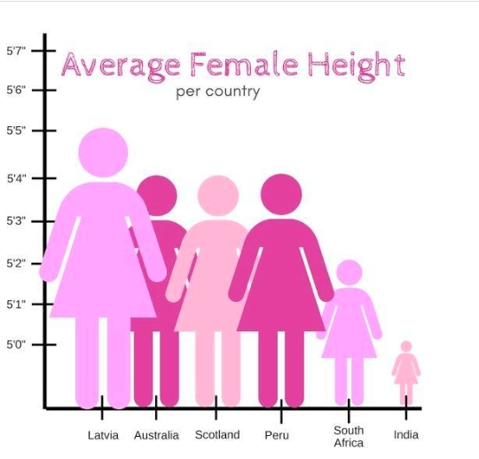
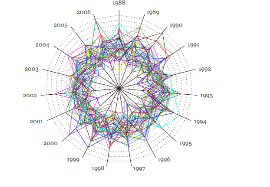

## 1er graphique
Ce graphique compare le salaire de joueurs des footballs, de la MLS au 1er mai 2013. 
Ici on arrive à comprendre que chaque bande corresponde à un club et que chaque rectangle représente un joueur.
Le problème est que le graphique est trop chargé, il y a trop d’information concentré sur un graphique. 

## 2eme graphique 
Le problème dans ce graphique c’est que les icônes changent à la fois en hauteur et en largeur, donc l’aire exagère les différences. J’aurais plutôt utilisé un graphique en barre qui serait plus clair. 
L’axe verticale ne commence pas a 0 ce qui accentue encore plus les écarts. Un bon graphique doit respecter les proportions sans déformer les données  

## 3eme graphique 

Les lignes se chevauchent trop, donc certaines valeurs sont cachées et on peut mal comprendre les résultats. Les couleurs se ressemblent aussi, ce qui peut faire confondre les données. Enfin, la forme en étoile peut donner l’impression qu’il y a une logique dans les résultats du loto, alors que les tirages sont aléatoires.

